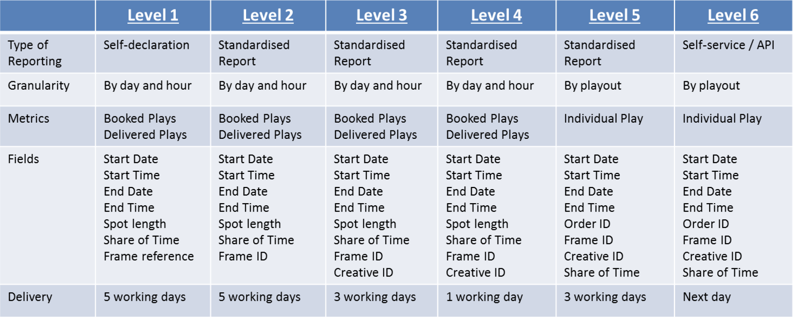
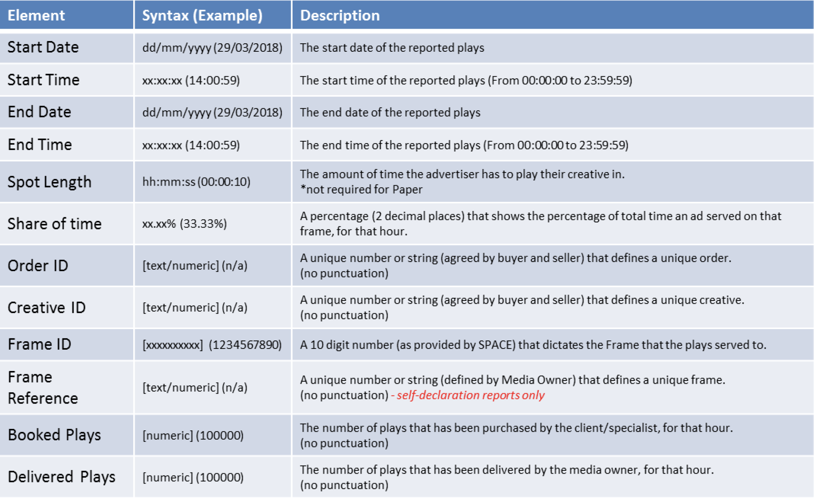
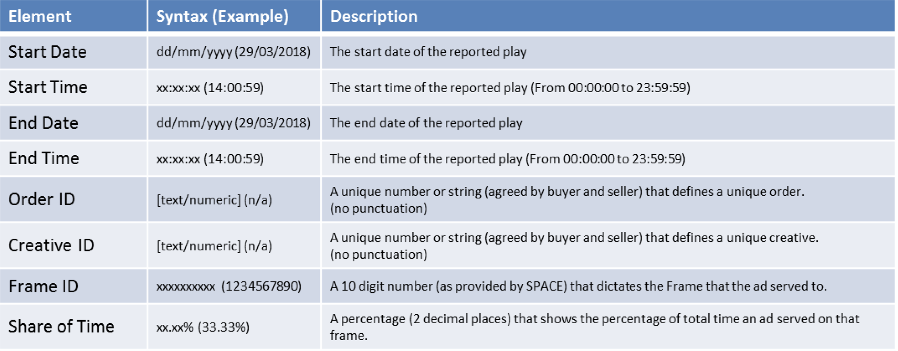

Playout Reporting Standard v2.0 - April 2021

# Contents

[1 About Outsmart](#1-about-outsmart)

[2 About OOH Industry Standards Committee](#2-about-ooh-industry-standards-committee)

[3 Introduction](#3-introduction)

[4 Asset Defintitions](#4-asset-definitions)

[5 Reporting Levels](#5-reporting-levels)

[6 The "Summary Report" Data Standard](#6-the-summary-report-data-standard)

[7 The “Playout Report” Data Standard](#7-the-playout-report-data-standard)

[8 Example Reports](#8-Example-Reports)

[9 JSON Schema](#9-JSON-Schema)

[10 JSON Filename](#10-JSON-Filename)

[11 Report Publishing](#11-Report-Publishing)

# 1 About Outsmart

Outsmart is the UK trade body for the Out of Home advertising industry. Our members include the biggest
sellers of OOH advertising in the UK including Clear Channel, Global, JCDecaux and Ocean Outdoor.

# 2 About OOH Industry Standards Committee

The OOH Standards Committee has representation from both Outsmart and IPAO. The IPAO represents the
biggest buyers of Out of Home advertising. The committee consults, develops and agrees upon standards which
are required to improve the efficiency and effectiveness of the operation of Out of Home Buying and Selling

# 3 Introduction

The agreed Reporting standard impacts any business that sends, receives or processes OOH reports. This
includes Media Owners, Specialists, Agencies and technology providers.

The document refers to a set of 6 _Reporting Levels_ that share the granularity and accountability of the type of
reporting that can be produced by a company. – A further update to this document is expected to cover Level 6
in more detail in the future.

The final part of this document sets out the expected _Data Standards_ of how this data should be provided, for
those companies sending or receiving this data between them.

The following document is a guideline that covers the minimum detail required and future revisions to this
document may add additional requirements.

# 4 Asset Definitions

SPACE is the industry database of OOH advertising assets.

The structure and scope of the database is defined by the OOH Standards Committee.

Every OOH asset held within the database is ascribed a unique reference number (Frame ID).

The characteristics of each asset are held within the database and subject to the agreed definitions.

# 5 Reporting Levels

This table sets out the attributes that differentiate the types of standard report.

Further work is to be undertaken on Level 6 to standardise transmission of Playout level data.

# 6 The “Summary Report” Data Standard

This is the standard for day/hour specific reporting that can be shared with customers to report on order-
specific campaign delivery.

The attached examples assume that they are accompanied by an Order ID that references that specific
campaign.

# 7 The “Playout Report” Data Standard

This is the standard for reporting on the display of campaigns that can be shared with customers if more
granular detail is required.

# 8 Example Reports

## Level 1 – Summary Report Example (Classic OOH)

## Level 1 – Summary Report Example (DOOH)

## Level 2 - Summary Report Example (Classic)

## Level 2 - Summary Report Example (DOOH)

## Level 3/4 - Summary Report Example (Classic)

## Level 3/4 - Summary Report Example (DOOH)

## Level 5/6 Playout Example (Classic)

## Level 5/6 Playout Example (DOOH)

# 9 JSON Schema

# 10 JSON Filename

# 11 Report Publishing
Inital reccomendation is via a shared folder, ftp location or bucket. 
