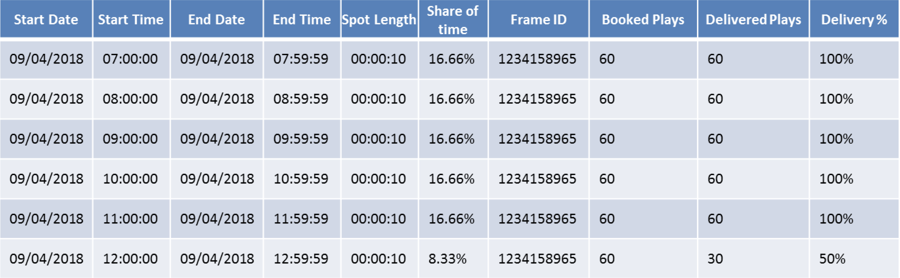
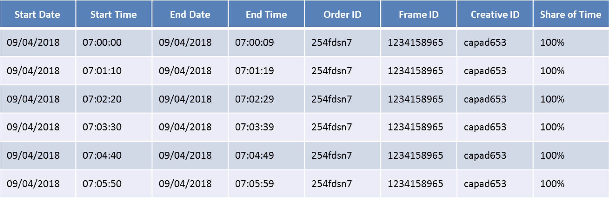

# Out-Of-Home Playout Reporting Standard v2.0 - April 2021

## Contributors

**Clear Channel** Karen Fornos Klein, Joao Baptista, Miles Talmey

**Global** Matt Allard, Denis Garcia, Olga Belousova

**JCDecaux** Rebecca Lee

**Kinetic** Prasaant Patel

**Knitting Media** Tim Harvey

**Mediacom** Nate Barker

**Mereo** Luka Djukic

**Ocean Outdoor** Angela Green, Doug Swan

**Posterscope** Daniel Conway, Alex Radu

**SignKick LiveDooh** Sebastiaan Schinkel

**Talon Outdoor** Anant East

**VIOOH** Ioana Dima, Jack Paget


# Contents

[1. About Outsmart](#1-about-outsmart)

[2. About OOH Industry Standards Committee](#2-about-ooh-industry-standards-committee)

[3. Introduction](#3-introduction)

[4. Asset Defintitions](#4-asset-definitions)

[5. Reporting Levels](#5-reporting-levels)

[6. The "Summary Report" Data Standard](#6-the-summary-report-data-standard)

[7. The “Playout Report” Data Standard](#7-the-playout-report-data-standard)

[8. Example Reports](#8-Example-Reports)

[9. JSON Schema](#9-JSON-Schema)

[10. JSON Filename](#10-JSON-Filename)

[11. Report Publishing](#11-Report-Publishing)


# 1. About Outsmart

Outsmart is the UK trade body for the Out of Home advertising industry. Our members include the biggest
sellers of OOH advertising in the UK including Clear Channel, Global, JCDecaux and Ocean Outdoor.

# 2. About OOH Industry Standards Committee

The OOH Standards Committee has representation from both Outsmart and IPAO. The IPAO represents the
biggest buyers of Out of Home advertising. The committee consults, develops and agrees upon standards which
are required to improve the efficiency and effectiveness of the operation of Out of Home Buying and Selling

# 3. Introduction

The agreed Reporting standard impacts any business that sends, receives or processes OOH reports. This
includes Media Owners, Specialists, Agencies and technology providers.

The document refers to a set of 6 _Reporting Levels_ that share the granularity and accountability of the type of
reporting that can be produced by a company. – A further update to this document is expected to cover Level 6
in more detail in the future.

The final part of this document sets out the expected _Data Standards_ of how this data should be provided, for
those companies sending or receiving this data between them.

The following document is a guideline that covers the minimum detail required and future revisions to this
document may add additional requirements.


# 4. Asset Definitions

SPACE is the industry database of OOH advertising assets.

The structure and scope of the database is defined by the OOH Standards Committee.

Every OOH asset held within the database is ascribed a unique reference number (Frame ID).

The characteristics of each asset are held within the database and subject to the agreed definitions.


# 5. Reporting Levels

This table sets out the attributes that differentiate the types of standard report.

It is reccomended that Media Owners and Publishers implement Level 5 or Level 6 as detailed in the [JSON Schema](#9-JSON-Schema)


# 6. The “Summary Report” Data Standard

This is the standard for day/hour specific reporting that can be shared with customers to report on order-
specific campaign delivery.

The attached examples assume that they are accompanied by an Order ID and Order Line ID that references that specific
campaign.


# 7. The “Playout Report” Data Standard

This is the standard for reporting on the display of campaigns that can be shared with customers if more
granular detail is required.


# 8. Example Reports

## Level 1 – Summary Report Example (Classic OOH)


## Level 1 – Summary Report Example (DOOH)


## Level 2 - Summary Report Example (Classic)


## Level 2 - Summary Report Example (DOOH)



## Level 3/4 - Summary Report Example (Classic)


## Level 3/4 - Summary Report Example (DOOH)


## Level 5/6 Playout Example (Classic)


## Level 5/6 Playout Example (DOOH)



# 9. JSON Schema
It is required that the ooh playout reporting is delivered at the 'Spot Level' of reporting granularity (Level 5 or Level 6 Reporting as detailed in this document)
The JSON schema is as follows:

## Reporting Object
| Attribute         | Description                                             | Type         |
| ----------------- | ------------------------------------------------------- | ------------ |
| ReportPublishTime | The time the Report was published                       | ISO-8601     |
| ReportStartTime   | The start time of the first playout event in the Report | ISO-8601     |
| ReportEndTime     | The end time of the last playout event in the Report    | ISO-8601     |
| Report            | Array of Report Objects                                 | Object Array |

## Report Object
| Attribute       | Description                                                                                                                                                                     | Type         |
| --------------- | ------------------------------------------------------------------------------------------------------------------------------------------------------------------------------- | ------------ |
| AccountId       | The buyer Account the Order was made to                                                                                                                                         | String(255)  |
| OrderId         | The Order ID                                                                                                                                                                    | String(255)  |
| LineId          | The Order Line ID                                                                                                                                                               | String(255)  |
| OOHProviderData | The OOHProviderData object is used for Buyers to detail structured information that may be used to identify their order in a Seller's system using their own IDs or references. | Object       |
| Stats           | An array of 'Stats' objects describing playout Report Data at 'Spot' level                                                                                                      | Object Array |

## Stats Object
| Attribute  | Description                                                        | Type        |
| ---------- | ------------------------------------------------------------------ | ----------- |
| StartTime  | Start Time of the 'Spot' playout event                             | ISO-8601    |
| EndTime    | End Time of the 'Spot' playout event                               | ISO-8601    |
| FrameId    | Media Owner's given ID for the Frame displaying the playout event  | String(255) |
| CreativeId | Media Owner's given ID for the creative shown in the playout event | String(255) |


## OOHProviderData Object
| Attribute            | Description                                                                                                                                                                                                                                                                                                                                          | Type         |
| -------------------- | ---------------------------------------------------------------------------------------------------------------------------------------------------------------------------------------------------------------------------------------------------------------------------------------------------------------------------------------------------- | ------------ |
| CampaignId           | Provided by the Buyer to uniquely identify the Advertising Campaign for which the Order is being placed                                                                                                                                                                                                                                              | String (255) |
| CampaignName         | A descriptive name provided by the Buyer which is associated with the Advertising Campaign for which the Order is being placed                                                                                                                                                                                                                       | String (255) |
| PoNumber             | Provided by Buyer as a reference to be used by Buyers for any offline contact related to the Order                                                                                                                                                                                                                                                   | String (255) |
| SalesOrderReference  | Provided by the Media Owner as a reference to be used by Buyers for any offline contact related to the Order                                                                                                                                                                                                                                         | String (255) |
| BarterOrganizationId | The OrganizationID of a Barter Company can be added here to flag a Barter transaction                                                                                                                                                                                                                                                                | String (255) |
| Other                | An opaque CLOB of provider-defined data. Providers may use this field as needed (for example, to store an ID that correlates this object with resources within their system). Note that any provider that edits this object may override the data in this field. The data should include a marker that you can identify to ensure the data is yours. | CLOB (10000) |


## Level 5 and Level 6 Classic Reporting JSON Example
```json
{
    "$schema": "https://raw.githubusercontent.com/Outsmart-OOH/ooh_open_direct/master/schema/v1/resources/stats/reporting.json",
    "ReportPublishTime": "2020-12-24T00:00:00.000Z",
    "ReportStartTime": "2020-12-09T00:00:00.000Z",
    "ReportEndTime": "2020-12-22T00:00:00.000Z",
    "Report": [{
        "AccountId": "23873345",
        "OrderId": "3479",
        "LineId": "7",
        "OOHProviderData": [
            "PO7567"
        ],
        "Stats": [
            {
                "StartTime": "2020-12-09T00:00:00Z",
                "EndTime":"2020-12-22T00:00:00Z",
                "FrameID":"1234159856",
                "CreativeID":"adfgj123"
            },
            {
                "StartTime": "2020-12-09T00:00:00Z",
                "EndTime":"2020-12-22T00:00:00Z",
                "FrameID":"1234159857",
                "CreativeID":"adfgj123"
            }
        ]
    }]
}
```
## Level 5 and Level 6 Digital Reporting JSON Example
```json
{
    "$schema": "https://raw.githubusercontent.com/Outsmart-OOH/ooh_open_direct/master/schema/v1/resources/stats/reporting.json",
    "ReportPublishTime": "2020-12-20T00:00:00.000Z",
    "ReportStartTime": "2020-12-09T00:00:00.000Z",
    "ReportEndTime": "2020-12-10T01:00:00.000Z",
    "Report": [{
        "AccountId": "23873345",
        "OrderId": "3479",
        "LineId": "8",
        "OOHProviderData": [
            "PO7567"
        ],
        "Stats": [
            {
                "StartTime": "2020-12-09T00:00:00Z",
                "EndTime": "2020-12-09T00:00:10Z",
                "FrameID": "1234158956",
                "CreativeID": "capad653"
            },
            {
                "StartTime": "2020-12-09T00:02:00Z",
                "EndTime": "2020-12-09T00:02:10Z",
                "FrameID": "1234158956",
                "CreativeID": "capad653"
            },
            {
                "StartTime": "2020-12-09T00:03:00Z",
                "EndTime": "2020-12-09T00:03:10Z",
                "FrameID": "1234158956",
                "CreativeID": "capad653"
            },
            {
                "StartTime": "2020-12-09T00:04:00Z",
                "EndTime": "2020-12-09T00:04:10Z",
                "FrameID": "1234158956",
                "CreativeID": "capad653"
            },
            {
                "StartTime": "etc",
                "EndTime": "etc",
                "FrameID": "etc",
                "CreativeID": "etc"
            }
        ]
    }]
}
```

# 10. JSON Filename

If the Report is generated for a single Order Line in an Order, the structure of the name of the JSON reporting file is as follows:

*AccountId_OrderId_LineId_StartTime_EndTime_PublishTime.json*
  
Where:
* AccountId = The Account ID of the campaign buyer
* OrderId = The Order ID of the campaign order
* LineId = The Order Line ID of the playout report 
* StartTime = The start time of the data written in the playout report
* EndTime = The end time of the data writted in the playout report 
* PublishTime = The time when the playout report file was written 

All time fields must be recorded in ISO-8601 format to Coordinated Universal Time (UTC)
The ':' is ommitted in the hour, minutes and seconds description as it is not recognised in filenames on common computer operating systems.
e.g. yyyy-mm-ddThhmmssZ

Example Filename:

*ACCT1234_OD54321_LN54321-1_2021-11-01T000000Z_2021-11-08T173000Z_2021-11-09T030000Z.json*

If the Report is generated at Order level (that contains an array of Reports for all lines in an Order) the filename shall be contructed as follows:
*AccountId_OrderId_StartTime_EndTime_PublishTime.json*

If the Report is generated at Account level (that contains an array of Reports for all Lines in all Orders from an Account) the filename shall be contructed as follows:
*AccountId_StartTime_EndTime_PublishTime.json*


# 11. Report Publishing
The inital reccomendation is that the playout reports are written to a secure shared folder, ftp location or bucket that is only made available to the relevant client account user(s)
The frequency of writing the playout reporting files is at the Media Owner / Publisher's discretion.
